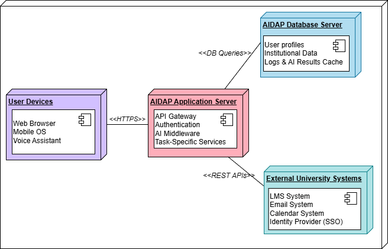

# ADD Iteration 1
**Project:** AIDAP — AI-Powered Digital Assistant Platform  
**Iteration:** 1 — Establishing an overall system structure

## Step 1. Review Inputs

| **Category** | **Details** |
|--------------|-------------|
| **Design purpose** | Greenfield system in a mature domain. Produce a detailed architecture to support construction of AIDAP that integrates with university systems and improves stakeholder communication and efficiency. |
| **Primary functional requirements** | UC-1:Because it enables core interactions by allowing users to query institutional information. UC-2:Because it keeps users informed through timely updates and announcements.  UC-3: Because it supports essential academic content management for lecturers and students. UC-6:Because secure authentication and personalization are vital for user trust and data protection. UC-8:Because synchronized data ensures accurate and consistent system responses. |
| **Quality attributes** | <table><thead><tr><th>Scenario ID</th><th>Importance to the Customer</th><th>Difficulty of Implementation (According to Architect)</th></tr></thead><tbody><tr><td>QA-1</td><td>High</td><td>Medium</td></tr><tr><td>QA-2</td><td>High</td><td>Medium</td></tr><tr><td>QA-3</td><td>Medium</td><td>Medium</td></tr><tr><td>QA-4</td><td>High</td><td>High</td></tr><tr><td>QA-5</td><td>High</td><td>High</td></tr><tr><td>QA-6</td><td>Medium</td><td>High</td></tr><tr><td>QA-7</td><td>Medium</td><td>Medium</td></tr><tr><td>QA-8</td><td>High</td><td>High</td></tr></tbody></table> From this list, **QA-1 (Performance)**, **QA-2 (Usability)**, **QA-4 (Security)**, **QA-5 (Availability)**, and **QA-8 (Interoperability)** are selected as the **architectural drivers** for Iteration 1, since they directly support the main user interactions and system dependability for AIDAP’s core functions.|
| **Constraints** | All six constraints (CON-1 to CON-6) mentioned in **Constraints.md** are considered for AIDAP since they collectively ensure security, integration, performance, accessibility, and maintainability for the selected use cases.|
| **Architectural concerns** | All six architectural concerns (CRN-1 to CRN-6) mentioned in **Concerns.md** are considered for AIDAP as they collectively ensure data privacy, system scalability, team efficiency, collaboration, consistent development practices, and seamless integration across all components.|

## Step 2: Establish Iteration Goal by Selecting Drivers

This is the first iteration in the design of AIDAP (AI-Powered Digital Assistant Platform), a greenfield system that integrates AI capabilities with institutional data systems.

The iteration goal is to establish an overall architectural foundation that ensures  secure, responsive, and scalable interaction between users and institutional data sources while also enabling reliable synchronization across all connected systems.

Although this iteration focuses on establishing the core architecture, the design must consider the primary quality attribute drivers and system constraints that make the foundation for future iterations and steps.

The architect must keep in mind the following key drivers:

* **QA-1**: **Performance**
* **QA-2**: Usability
* **QA-4**: Security
* **QA-5**: Availability
* **QA-8**: Interoperability

Additional constraints influencing this iteration include:

* **CON-1**: Data privacy and compliance with institutional security policies.
* **CON-2**: **Seamless integration with approved university systems.**
* **CON-3**: Cloud-based deployment supporting scalability and uptime targets.
* **CON-4**: Multi-platform accessibility (web, mobile, voice).

Architectural concerns shaping this iteration:

* **CRN-1**: Maintain data privacy and compliance.
* **CRN-2**: Design for scalability and maintainability.
* **CRN-6**: Ensure proper integration between frontend and backend components.

**Diagram here!!**

## Step 3: Choose one or more elements on the system to refine

Since AIDAP is a greenfield system, the element chosen for refinement in this iteration is the entire AIDAP platform, including its core components:

* User interaction layer (web, mobile, voice)
* AI assistant engine
* Backend service layer
* Integration and data synchronization layer
* Institutional database and external system connectors

In this iteration, refinement is performed through high-level decomposition, establishing the foundational structure that will support secure authentication, fast responses, and reliable data synchronization across university systems.

## Step 4: Choose One or More Design Concepts That Satisfy the Selected Drivers

| **Design Decision & Locations** | **Rationale** |
|--------------------------------|----------------|
| **Logically structure the system using a Hybrid Layered and Microservices Reference Architecture.**|The hybrid combination of Layered and Microservices architectures allows AIDAP to separate concerns across presentation, logic, and data layers (Layered pattern) while maintaining modular and independently deployable services (Microservices). This approach supports QA-1 (Performance) by allowing concurrent processing and scalability, QA-4 (Security) through isolated modules with defined APIs, and QA-8 (Interoperability) by enabling seamless integration with multiple institutional systems through microservice-based connectors.    **Discarded Alternatives** <table><tr><th>Alternative</th><th>Reason for Discarding</th></tr><tr><td>**Monolithic Architecture**</td><td>Rejected because it would tightly couple UI,  business logic, and data management, making the system difficult to scale,  maintain, and update (violates QA-3 and QA-6).</td></tr><tr><td>**Pure Microservices Architecture**</td><td>Discarded because the project is in early development and lacks the need for  full-scale microservice independence. A hybrid layered approach ensures simpler  coordination and lower initial complexity.</td></tr><tr><td>**Client-Server Architecture**</td><td>Not selected because it provides limited flexibility and poor scalability compared  to modern web-based distributed designs.</td></tr></table>|
|**Use a Three-Tier Deployment Pattern (Client → Backend → Database)**| A three-tier deployment structure supports AIDAP by separating the presentation layer, application logic, and data management, ensuring clear distribution of responsibilities and simplified maintenance. This structure aligns with CON-4 by enabling consistent access across multiple platforms and supports CON-3 through compatibility with scalable cloud deployment environments. It also contributes to QA-1 (Performance) and QA-5 (Availability) by allowing each tier to scale independently and maintain operation under high load. Additionally, isolating AI-driven logic within the application tier improves maintainability and supports CRN-2 by keeping complex processing separate from the user interface.    **Discarded Alternatives:** <table><tr><th>Alternative</th><th>Reason for Discarding</th></tr><tr><td>**Two-Tier Architecture**</td><td>Not chosen because data must come from many external institutional systems, which   requires a dedicated backend tier.</td></tr><tr><td> **Multi-Tier**(i.e. n > 3)</td><td>Not selected at this stage since additional tiers would increase complexity and are not  needed until specific modules (like analytics) are more advanced.</td></tr></table>|
|**Implement the Client Layer Using Web + Mobile + Voice Interfaces**| Implementing the client layer through Web, Mobile, and Voice interfaces ensures that AIDAP is accessible across all major platforms used by students and faculty, supporting CON-4 (multi-platform accessibility). This approach enhances QA-2 (Usability) by providing users with flexible interaction options, and it improves inclusivity by supporting hands-free and mobile access. Separating these interfaces from backend logic also aligns with CRN-2 by keeping interface development modular and maintainable.    **Discarded alternative:** <table><tr><th>Alternative</th><th>Reason for Discarding</th></tr><tr><td>**Single-platform** (web-only or mobile-only)</td><td>Discarded because it contradicts accessibility and user convenience  requirements.</td></tr></table>|
|**Use an AI Middleware Layer for Query Interpretation and Response Generation**|Using an AI middleware layer for query interpretation and response generation strengthens the system by ensuring that natural language queries are processed efficiently, directly supporting QA-1 (Performance). This layer also enhances QA-4 (Security) by isolating the user data from the core AI model, preventing unnecessary exposure of sensitive information. Additionally, placing AI logic in a modular and independent layer improves maintainability and adaptability, which aligns with CON-5, as it allows the system to evolve, update, or change AI components without breaking the rest of the architecture.    **Discarded Alternatives:** <table><tr><th>Alternative</th><th>Reason for Discarding</th></tr><tr><td>**Direct model embedding inside frontend**</td><td>Discarded due to security risks and high resource requirements.</td></tr></table>|
|**Use API Gateway + Authentication Service with Institutional SSO**|This design satisfies QA-4 (Security) and CON-1 (Privacy Rules) by enforcing strong privacy protections and centralized access management. It also centralizes access control to ensure consistent and secure handling of user data. Additionally, by managing load distribution, it helps maintain QA-5 (Availability), ensuring the system stays responsive even during peak hours.   **Discarded Alternatives** <table><tr><th>Alternative</th><th>Reason for Discarding</th></tr><tr><td>**Independent authentication within each service**</td><td>Discarded because it duplicates logic, makes the code  unnecessarily longer, and increases security risks.</td></tr></table>|

## Step 5:  Instantiate Architect
ural Elements, Allocate Responsibilities, and Define Interfaces
In this iteration, several design concepts selected in Step 4 are instantiated into concrete architectural elements. The focus is on identifying which modules must exist and the responsibilities that they need to acquire.(Detailed interfaces will be defined in later iterations)

| **Design Decision and Location** | Rationale |
|----------------------------------|-----------|
| **Create a dedicated AI Middleware Module** | Required to support the Step-4 decision of separating AI logic from backend services. This module will handle natural-language interpretation and response generation, supporting QA-1 (Performance) and QA-4 (multi-platform access). |
| **Instantiate an API Gateway Component** | Supports Step-4 decision to centralize access control. Ensures CON-1 compliance and improves QA-5 by managing load before requests reach backend services. |
| **Instantiate a Multi-Interface Client Module (Web, Mobile, Voice)** | Required by the Step-4 decision to support CON-4 (multi-platform access). This module will help handle user interactions and forward all queries to the backend. |
| **Create Backend Service Modules (Announcements, Authorization, LMS Queries, Profiles)** | These modules support Step-4’s decision of using a scalable service layer. They support UC-1, UC-2, UC-3 and ensure backend logic is separated from AI processing (CRN-2). |
| **Instantiate Integration Connectors for LMS, Identity, and Institutional Systems** | Supports QA-8 and CON-2 by formalizing the components that interact with external university systems. |
| **Create a Central Data Store** | Supports CON-3 and QA-5. Stores user profiles, logs, and synchronized data shared by AI and backend services. |

## Step 6: Sketch views and Record Design Decisions

### Elements & Responsibility Table
This sketch was created using draw.io. Each element in the diagram was selected and assigned a short description of its responsibilities. At this stage, the descriptions are intentionally simple and only outline the major functional responsibilities of each module, without going into detailed behavior. The following table summarizes the information that is captured for the AIDAP reference architecture.

| **Element** | Responsibility |
|-------------|---------------|
| **Client Presentation Layer** | Displays the user interface (web/mobile/voice), collects user input, and sends requests to the API Gateway. |
| **API Gateway** | Authenticates users, enforces access control, rate limits, and routes incoming requests to AI Middleware or backend services. |
| **AI Middleware Service** | Performs NLP, intent classification, and converts natural-language queries into structured service requests. |
| **Backend Services** | Executes domain-specific operations, retrieves required data, applies business rules, and coordinates workflows. |
| **Integration Connectors (LMS, Identity, Institutional Systems)** | Communicate with external university systems, transform incoming data, and synchronize external information with backend services. |
| **Central Data Store** | Stores AIDAP-related data such as user profiles, logs, cached LMS/announcement data, and maintains backups/replication. |
| **External University Systems** | Provide authoritative LMS, schedule, identity, and institutional data accessed through Integration Connectors. |

### Deployment Diagram Description for AIDAP
| **Element** | Responsibility |
|-------------|---------------|
| **User Workstations (Web Browser, Mobile OS, Voice Assistant)** | Run the client interface and send requests to AIDAP through HTTPS. |
| **AIDAP Application Server (API Gateway, Authentication, AI Middleware, Task Services)** | Processes all incoming requests, performs authentication, runs AI logic, and executes task-specific services. |
| **AIDAP Database Server (User Profiles, Institutional Data, Logs & AI Cache)** | Stores all persistent data including users, institutional datasets, logs, and cached AI results. |
| **External University Systems (LMS, Calendar, SSO Identity Provider)** | Provide academic data, scheduling information, and identity verification to AIDAP. |

### Relationships Between Deployment Elements
| **Relationship** | Description |
|------------------|-------------|
| **User Workstations and AIDAP Application Server (API Gateway)** | Clients communicate with the server using secure HTTPS calls. |
| **AIDAP Application Server and AIDAP Database Server** | Server executes DB queries to read/write user profiles, logs, and institutional data. |
| **AIDAP Application Server and External University Systems** | The server interacts with LMS, Calendar, and SSO services via REST APIs and institution-approved protocols. |

