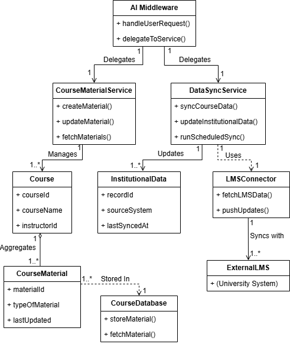
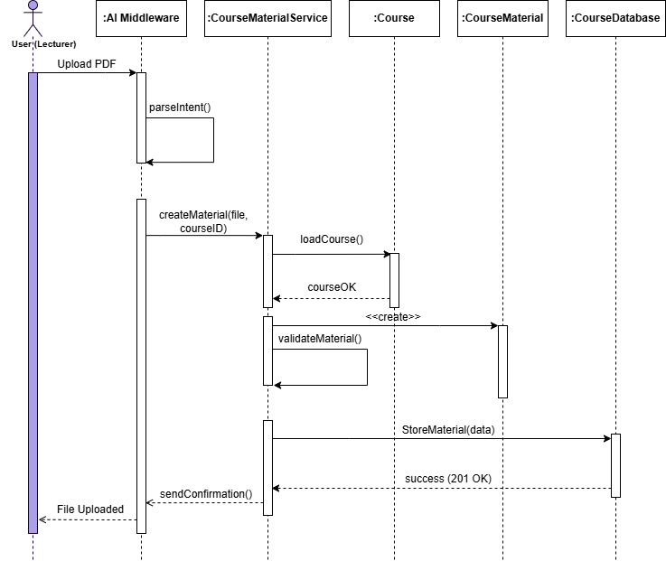
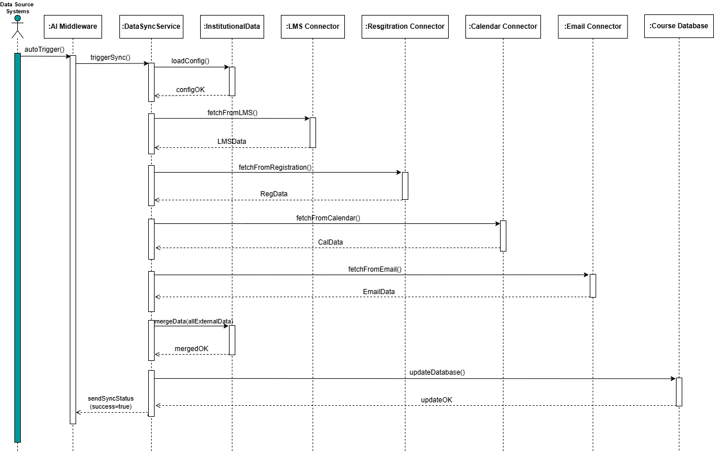

# ADD Iteration 2
**Project:** AIDAP - AI-Powered Digital Assistant Platform  
**Iteration:** 2 - Identifying Structures to Support Primary Functionality  
[**PDF Version for Iteration 2**](Iterations%20Doc/ADD_Iteration_2_PhaseII_Group27.pdf)

## Step 1. Review Inputs (Same as Iteration 1)

| **Category** | **Details** |
|--------------|-------------|
| **Design purpose** | Greenfield system in a mature domain. Produce a detailed architecture to support construction of AIDAP that integrates with university systems and improves stakeholder communication and efficiency. |
| **Primary functional requirements** | **UC-1:** Because it enables core interactions by allowing users to query institutional information.  **UC-2:** Because it keeps users informed through timely updates and announcements.  **UC-3:** Because it supports essential academic content management for lecturers and students.  **UC-6:** Because secure authentication and personalization are vital for user trust and data protection.  **UC-8:** Because synchronized data ensures accurate and consistent system responses. |
| **Quality attributes** | <table><thead><tr><th>Scenario ID</th><th>Importance to the Customer</th><th>Difficulty of Implementation (According to Architect)</th></tr></thead><tbody><tr><td>QA-1</td><td>High</td><td>Medium</td></tr><tr><td>QA-2</td><td>High</td><td>Medium</td></tr><tr><td>QA-3</td><td>Medium</td><td>Medium</td></tr><tr><td>QA-4</td><td>High</td><td>High</td></tr><tr><td>QA-5</td><td>High</td><td>High</td></tr><tr><td>QA-6</td><td>Medium</td><td>High</td></tr><tr><td>QA-7</td><td>Medium</td><td>Medium</td></tr><tr><td>QA-8</td><td>High</td><td>High</td></tr></tbody></table> From this list, **QA-1 (Performance)**, **QA-2 (Usability)**, **QA-4 (Security)**, **QA-5 (Availability)**, and **QA-8 (Interoperability)** are selected as the **architectural drivers** for Iteration 1, since they directly support the main user interactions and system dependability for AIDAP’s core functions.|
| **Constraints** | All six constraints (CON-1 to CON-6) mentioned in **Constraints.md** are considered for AIDAP since they collectively ensure security, integration, performance, accessibility, and maintainability for the selected use cases.|
| **Architectural concerns** | All six architectural concerns (CRN-1 to CRN-6) mentioned in **Concerns.md** are considered for AIDAP as they collectively ensure data privacy, system scalability, team efficiency, collaboration, consistent development practices, and seamless integration across all components.|

---

## Step 2: Establish Iteration Goal by Selecting Drivers

The goal of this iteration is to address the general architectural concern of identifying and refining the internal structures and detailed interfaces required to support the primary functional requirements of the AIDAP system. Identifying these elements is crucial for understanding how functionality is realized across the service modules and for enabling effective work allocation to development teams, addressing the concerns of **CRN-3 (Workload Balancing and Efficiency)** and **CRN-4 (Collaboration and Communication)**.

In this second iteration, besides the functional implementation concern, the architect considers the system's primary use cases that were partially addressed in Iteration 1:

- **UC-3: Manage and Publish Course Materials**  
- **UC-8: Synchronize Institutional Data**

---

## Step 3: Choose One or More Elements of the System to Refine

In this iteration, we focus on refining the specific parts of AIDAP that directly support UC-3 and UC-8. This includes the backend services for course materials, the connectors that sync data with university systems, and the interfaces between the AI middleware and these services. These components are refined because they need to work together smoothly across different layers to handle academic content and keep institutional data updated.

---

## Step 4: Choose One or More Design Concepts That Satisfy the Selected Drivers

This step selects detailed design concepts and patterns that will ensure the reliable implementation of UC-3 (Manage Course Materials) and UC-8 (Synchronize Institutional Data) within the Task-Specific Services, Integration Connectors, and Data Layer being refined.

| Design Decisions and Location | Rationale and Assumptions |
|------------------------------|----------------------------|
| Use Service Decomposition for Course Material and Data-Sync Services | Breaking UC-3 and UC-8 into smaller backend services ensures each function (course materials, LMS sync, resource updates) is easier to maintain and can be assigned to different team members. This supports CRN-3 and CRN-4 by improving team productivity and reducing coupling thus improving efficiency .  **Discarded Alternatives:** Keep all features inside one large service, but this was rejected because it increases complexity, creates merge conflicts, and slows down development. |
| Adopt a Clear API Interface Pattern Between AI Middleware, Backend Services, and Connectors | A structured API design ensures smooth communication between the AI layer, backend services, and university systems. This helps reduce integration errors and supports cross-layer consistency for UC-3 and UC-8.  **Discarded Alternatives:** Allow each developer to design APIs independently, but this risks inconsistent endpoints, duplicates logic, and slows integration. |
| Apply a Data Synchronization Pattern for Institutional Systems (LMS, Course Updates, Resources) | Ensures data exchanged between external institutional systems and AIDAP stays accurate and up-to-date. This pattern supports reliability and reduces the chance of stale or mismatched academic data.  **Alternative Considered:** Perform manual or ad-hoc synchronization, but this can lead to data drift, increased maintenance work, and unreliable system behavior. |

---

## Step 5: Instantiate Architectural Elements, Allocate Responsibilities, and Define Interfaces

| Design Decisions and Location | Rationale |
|------------------------------|-----------|
| Instantiate separate backend services for Course Material Management and Data Synchronization | The system now needs real backend components & not just concepts. Creating two concrete services (CourseMaterialService and DataSyncService) makes it clear which team member handles UC-3 and which handles UC-8, supporting CRN-3 (workload balancing). It also ensures each service can be tested individually, supporting CRN-4. |
| Define explicit API interfaces between AI Middleware , Backend Services & Integration Connectors | Since Step 4 selected a structured API pattern, this step instantiates the actual API endpoints and request structures. Clear interfaces prevent integration mistakes and ensure each module knows exactly how to communicate. This also prepares the modules for unit testing and mock testing. |
| Instantiate Connector Modules for LMS, Course Database, and Institutional Systems | To support UC-8, the connectors described earlier must now be created as real modules with clear responsibilities: fetch, update, and validate data. Instantiating these connectors ensures reliable syncing and avoids ambiguity about where data transformations occur. |
| Allocate responsibilities across layers (Task-Specific Services → Connectors → Data Layer) | Responsibilities are now divided: services handle logic, connectors handle communication, and the data layer handles storage. This reduces coupling and clarifies which component owns which part of the workflow, preventing overlap or duplication in work. This also makes the management easier. |
| Define data exchange structures for synchronization | Since data-sync reliability is a driver in this iteration, the system must define the exact data formats and mapping rules used between systems. This prevents inconsistent data during syncing and reduces errors caused by unclear formats. |

---

## Step 6: Sketch Views and Record Design Decision

As a result of the decisions made in step 5, several diagrams are created.  
Figure 1 shows an initial domain model for the system.  
Figure 2 shows the domain objects that are instantiated for the use case model in UseCases.md.  
Figure 3 shows a sketch of a module view with modules that are derived from the business objects and associated with the primary use cases. Note: Explicit interfaces aren’t shown but their existence is assumed.  
Figure 4 shows the initial sequence diagram from UC-3.  
Figure 5 shows the initial sequence diagram for UC-8.

---

## Figure 1  

  

---

## Figure 2

  

---

## Figure 3

  

---

## Client Side

| **Element** | **Responsibility** |
|-------------|----------------------|
| Text/Voice UI | Captures user input (text or voice) and displays assistant responses. |
| Dashboard UI | Presents analytics, schedules, and course summaries visually. |
| Notification UI | Displays alerts, reminders, and announcements to the user. |
| Query Processor | Interprets user questions and prepares requests for the server. |
| Material Manager | Handles browsing, retrieving, and sending material-related actions. |
| User Preference Handler | Manages local user settings such as language and notification preferences. |
| Local Cache | Stores frequently accessed data (recent queries, materials) for faster UI loading. |
| Token Storage | Stores authentication tokens safely for session management. |

## Server Side

| **Element** | **Responsibility** |
|-------------|----------------------|
| Query Service | Handles academic/administrative information requests from clients. |
| Notification Service | Delivers announcements, reminders, and triggered alerts. |
| API Gateway | Provides endpoints for dashboards and analytics requests. |
| Query Interpretation Engine | Processes and refines user intents before server logic runs. |
| Analytics Engine | Computes metrics such as grades, attendance, and engagement. |
| Integration Manager | Manages connections with LMS, registration, calendars, and external systems. |
| Authentication Manager | Handles SSO login, token validation, and identity verification. |
| Institutional DB Access | Reads/writes user, course, material, and analytics data. |
| LMS Connectors | Syncs and fetches data from external institutional platforms. |
| System Logs Store | Records system events, errors, and audit data for monitoring. |
| Sync Scheduler | Automates and triggers data synchronization jobs on a schedule. |

---

## Figure 4: UC-3 Sequence Diagram Description
The sequence diagram shows how a lecturer uploads a PDF and how the system processes it. First, the User sends the file to the AI Middleware, which analyzes the request. The middleware then calls the CourseMaterialService to create new course material. This service loads the related Course, creates a CourseMaterial object, validates it, and finally stores it in the CourseDatabase. Once the database confirms success, the service sends a confirmation back to the middleware, which then notifies the user that the upload is complete. Then the changes will be reflected on the students application as well.

---

  

---

From the interactions identified in the sequence diagram, initial methods for the interfaces of the interacting elements can be identified:

## Interface Methods Identified from the Sequence Diagram

| **Method Name** | **Description** |
|-----------------|-----------------|
| **Element: AI Middleware** |  |
| `parseIntent()` | Analyzes the lecturer’s request (“Upload PDF”) to understand the action and extract required parameters such as file type and courseID. |
| **Element: CourseMaterialService** |  |
| `createMaterial(file, courseID)` | Starts the creation process for new course material by receiving the file and course identifier from the AI Middleware. |
| `loadCourse()` | Retrieves the corresponding Course object using the provided courseID to ensure the course exists. |
| `validateMaterial()` | Validates the uploaded file (format, size, metadata) to ensure it meets system requirements before storage. |
| `storeMaterial(data)` | Saves the validated CourseMaterial object into the CourseDatabase. |
| `sendConfirmation()` | Sends a confirmation message back to AI Middleware once the material is stored successfully. |
| **Element: Course** |  |
| `courseOK` (response) | Indicates that the Course exists and is valid for attaching new course material. |
| **Element: CourseMaterial** |  |
| `<<create>>` | Instantiates a new CourseMaterial object using the uploaded PDF file and associated course information. |
| **Element: CourseDatabase** |  |
| `success (201 OK)` (response) | Confirms that the course material was successfully stored in the database. |

---

## Figure 5 UC-8
The sequence diagram illustrates how AIDAP automatically synchronizes institutional data with external systems. First, the Data Source Systems trigger the AI Middleware, which then invokes the DataSyncService to begin synchronization. The service loads the configuration settings and sequentially fetches data from the  four connectors: LMS, Registration, Calendar, and Email. After receiving all external data, the service merges the information and updates the CourseDatabase. Once the update is successful, the DataSyncService sends a confirmation back to the AI Middleware, which then reports the synchronization status to the data source systems. This ensures that institutional data is always kept accurate and up to date across all connected platforms.

---

  

---

From the interactions identified in the sequence diagram, initial methods for the interfaces of the interacting elements can be identified:

| **Method Name** | **Description** |
|-----------------|-----------------|
| **Element: Data Source Systems** |  |
| `autoTrigger()` | Automatically triggers the synchronization process at scheduled or configurable intervals. |
| **Element: AI Middleware** |  |
| `triggerSync()` | Receives the auto-trigger event and forwards the synchronization request to the DataSyncService. |
| **Element: DataSyncService** |  |
| `loadConfig()` | Loads synchronization settings and rules |
| `fetchFromLMS()` | Connects to the LMS Connector to retrieve updated learning management data. |
| `fetchFromRegistration()` | Retrieves updated student/course registration information from the Registration Connector. |
| `fetchFromCalendar()` | Fetches institutional calendar updates such as deadlines, events, and schedules. |
| `fetchFromEmail()` | Retrieves email-related metadata such as announcement logs or distribution lists. |
| `mergeData(allExternalData)` | Combines all fetched data into a unified InstitutionalData structure for consistency and conflict resolution. |
| `updateDatabase()` | Applies the merged institutional data into the CourseDatabase, ensuring information remains up-to-date. |
| `sendSyncStatus(success=true)` | Sends a success confirmation back to the AI Middleware after synchronization completes. |
| **Element: LMS Connector** |  |
| `LMSData()` (response) | Returns updated LMS data when requested by DataSyncService. |
| **Element: Registration Connector** |  |
| `RegData()` (response) | Returns updated course registration data. |
| **Element: Calendar Connector** |  |
| `CalData()` (response) | Returns institutional calendar updates. |
| **Element: Email Connector** |  |
| `EmailData()` (response) | Returns email system data used for synchronization. |
| **Element: CourseDatabase** |  |
| `InstitutionalData()` (response) | Stores the merged and updated institutional dataset received from DataSyncService. |

---

## Step 7: Perform Analysis of Current Design and Review Iteration Goal and Achievement of Design Purpose

| Not Addressed | Partially Addressed | Completely Addressed | Design Decisions Made During the Iteration |
|---------------|----------------------|------------------------|--------------------------------------------|
|               |                      |           **UC-3**             | Introduced CourseMaterialService; defined validation/storage flow; created domain objects (Course, CourseMaterial). Sequence diagram drafted. |
|               |                      |            **UC-8**            | Created DataSyncService, LMS/Institution connectors, data-mapping structures, and sync scheduler concept. |
|               |                      |            **QA-4**            | Authentication & access rules reinforced (supports Security). |
|               |                      |            **QA-5**            | Defined data-sync structures (improves Availability/Reliability). |
|               |                      |            **QA-8**            | Introduced external system connectors (improves Interoperability). |
|               |         **QA-7**             |                        | Created structured API interfaces (improves Reliability & Scalability). |
|               |                      |          **CON-1**              | Added local caching rules and structured services to support multi-interface access. |
|               |                      |             **CON-2**           | Added LMS/Calendar/Registration connectors to comply with integration requirements. |
|               |                      |             **CON-4**           | Enforced API Gateway authentication & token rules. |
|               |           **CON-6**           |                        | Added system logging responsibilities supporting monitoring requirements. |
|               |           **CRN-1**           |                        | Data connectors isolate integration concerns. |
|               |           **CRN-2**           |                        | Clear division of logic/data/connector responsibilities supports maintainability. |
|               |            **CRN-3**          |                        | Service decomposition helps workload division and testing approach. |
|               |           **CRN-6**           |                        | API standardization supports collaboration. |
